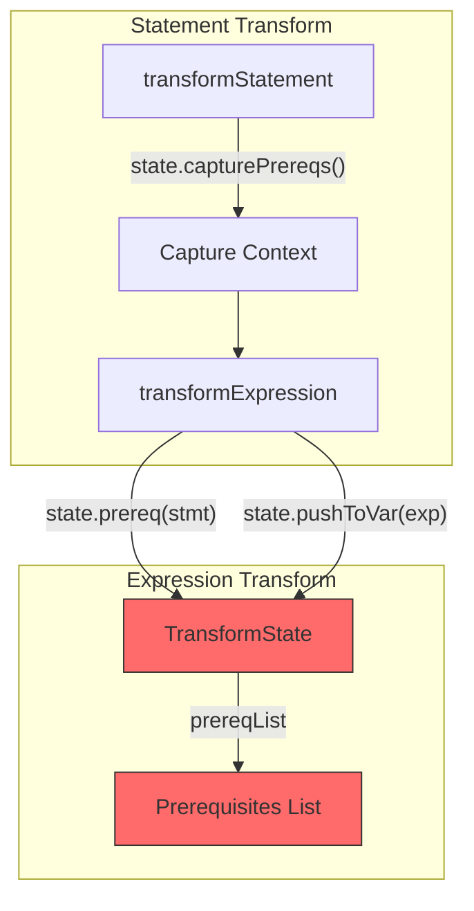
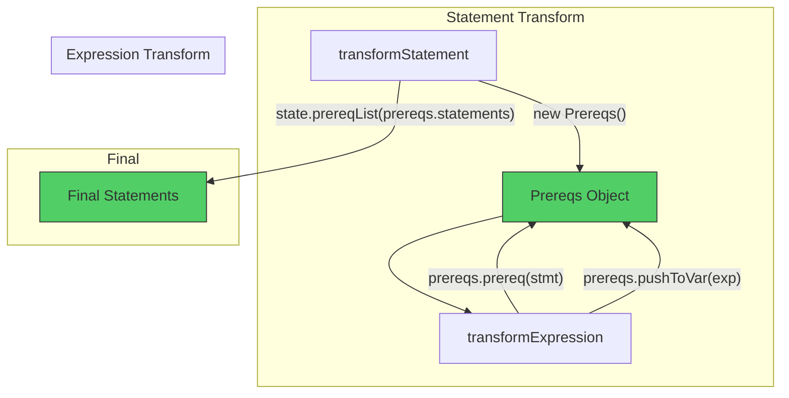
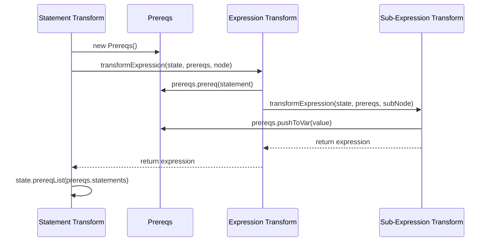

# Prereqs Refactoring Plan

## 📋 Status Refaktoryzacji (31 Dec 2024)

**Kompilacja TypeScript:** ✅ **0 błędów**
**Testy TypeScript:** ✅ **142/142 przeszło**
**Testy Roblox:** ⚠️ **390/498 przeszło, 108 niepowodzeń**

### Podsumowanie

Celem refaktoryzacji jest wprowadzenie klasy `Prereqs` do zarządzania wymaganiami wstępnymi (prerequisite statements) podczas transformacji AST. Zamiast używać `state.prereq()`, `state.pushToVar()` itp., funkcje transformacji używają teraz obiektu `Prereqs` przekazywanego jako parametr.

---

## 🔄 Diagramy Architektury

### Przed refaktoryzacją (stary wzorzec)



### Po refaktoryzacji (nowy wzorzec)



### Przepływ danych - Expression Transforms



---

## ✅ Co zostało ZROBIONE

### 1. Klasa Prereqs (100%)

- [x] Utworzono `src/TSTransformer/classes/Prereqs.ts`
- [x] Zaimplementowano metody: `prereq()`, `prereqList()`, `pushToVar()`, `pushToVarIfComplex()`, `pushToVarIfNonId()`

### 2. Makra (100%)

- [x] `callMacros.ts` - wszystkie makra zaktualizowane
- [x] `constructorMacros.ts` - wszystkie makra zaktualizowane
- [x] `propertyCallMacros.ts` - wszystkie makra zaktualizowane
- [x] `types.ts` - typy makr zaktualizowane

### 3. Utility Functions (100%)

- [x] `ensureTransformOrder.ts` - zaktualizowane
- [x] `createTruthinessChecks.ts` - zaktualizowane

### 4. Expression Transforms (100%)

Wszystkie 34 pliki w `src/TSTransformer/nodes/expressions/` zaktualizowane:

- [x] transformArrayLiteralExpression.ts
- [x] transformAwaitExpression.ts
- [x] transformBinaryExpression.ts (częściowo - wewnętrzne wywołania)
- [x] transformBooleanLiteral.ts
- [x] transformCallExpression.ts
- [x] transformClassExpression.ts
- [x] transformConditionalExpression.ts
- [x] transformDeleteExpression.ts
- [x] transformElementAccessExpression.ts
- [x] transformExpression.ts (główny dispatcher)
- [x] transformFunctionExpression.ts
- [x] transformIdentifier.ts
- [x] transformImportExpression.ts
- [x] transformNewExpression.ts
- [x] transformNoSubstitutionTemplateLiteral.ts
- [x] transformNumericLiteral.ts
- [x] transformObjectLiteralExpression.ts
- [x] transformOmittedExpression.ts
- [x] transformParenthesizedExpression.ts
- [x] transformPropertyAccessExpression.ts
- [x] transformRegularExpressionLiteral.ts
- [x] transformSpreadElement.ts
- [x] transformStringLiteral.ts
- [x] transformSuperKeyword.ts
- [x] transformTaggedTemplateExpression.ts
- [x] transformTemplateExpression.ts
- [x] transformThisExpression.ts
- [x] transformTypeExpression.ts
- [x] transformUnaryExpression.ts
- [x] transformVoidExpression.ts
- [x] transformYieldExpression.ts

### 5. Statement Transforms (częściowo)

- [x] transformDoStatement.ts
- [x] transformExpressionStatement.ts
- [x] transformForOfStatement.ts (częściowo)
- [x] transformForStatement.ts (częściowo)
- [x] transformIfStatement.ts
- [x] transformReturnStatement.ts
- [x] transformSwitchStatement.ts
- [x] transformThrowStatement.ts
- [x] transformVariableStatement.ts (częściowo)
- [x] transformWhileStatement.ts

---

## ❌ Co ZOSTAŁO do zrobienia

### 🔴 TRUDNE (Senior) - Wymagają głębokiego zrozumienia architektury

#### 1. Binding Patterns (4 pliki)

```
src/TSTransformer/nodes/binding/
├── transformArrayAssignmentPattern.ts - dodać prereqs do sygnatury
├── transformArrayBindingPattern.ts - dodać prereqs do sygnatury
├── transformBindingName.ts - dodać prereqs do sygnatury
└── transformObjectAssignmentPattern.ts - dodać prereqs do sygnatury
└── transformObjectBindingPattern.ts - dodać prereqs do sygnatury
```

#### 2. transformBinaryExpression.ts - KRYTYCZNE

Plik ma wiele wewnętrznych wywołań do innych funkcji które jeszcze nie mają prereqs:

- `transformArrayAssignmentPattern`
- `transformObjectAssignmentPattern`
- `transformWritableAssignment`
- `transformLogicalOrCoalescingAssignmentExpression`

#### 3. transformWritable.ts

- `transformWritableExpression` - dodać prereqs
- `transformWritableAssignment` - dodać prereqs

#### 4. transformLogical.ts / transformLogicalOrCoalescingAssignmentExpression.ts

Złożona logika z chain building - wymaga starannej refaktoryzacji.

#### 5. transformOptionalChain.ts

Obsługa optional chaining z prereqs.

### 🟡 ŚREDNIE (Mid-level)

#### 6. Class Transforms (4 pliki)

```
src/TSTransformer/nodes/class/
├── transformClassConstructor.ts
├── transformClassLikeDeclaration.ts
├── transformDecorators.ts
└── transformPropertyDeclaration.ts
```

#### 7. JSX Transforms (5 plików)

```
src/TSTransformer/nodes/jsx/
├── transformJsx.ts
├── transformJsxAttributes.ts
├── transformJsxChildren.ts
├── transformJsxFragment.ts
└── transformJsxTagName.ts
```

### 🟢 ŁATWE (Junior) - Proste aktualizacje wywołań

#### 8. Statement Transforms - pozostałe wywołania

- transformEnumDeclaration.ts - 2 wywołania transformExpression
- transformExportAssignment.ts - 3 wywołania transformExpression
- transformFunctionDeclaration.ts - 1 wywołanie

#### 9. Aktualizacje wywołań w już zmienionych plikach

Szukaj wzorca: `transformExpression(state,` bez `prereqs`

---

## 📝 Wzorce do zastosowania

### Wzorzec 1: Wywołanie z expression transform do expression transform

```typescript
// PRZED:
const exp = transformExpression(state, node);

// PO:
const exp = transformExpression(state, prereqs, node);
```

### Wzorzec 2: Wywołanie ze statement transform

```typescript
// PRZED:
const [exp, prereqs] = state.capture(() => transformExpression(state, node));

// PO:
const prereqs = new Prereqs();
const exp = transformExpression(state, prereqs, node);
// lub jeśli potrzeba listy:
const [exp, stmtPrereqs] = state.capture(() => transformExpression(state, new Prereqs(), node));
```

### Wzorzec 3: Zamiana state.prereq na prereqs.prereq

```typescript
// PRZED:
state.prereq(statement);
state.pushToVar(exp);

// PO:
prereqs.prereq(statement);
prereqs.pushToVar(exp);
```

---

## 🎯 Kolejność wykonania

### Faza 1: Senior (obecnie w toku)

1. ✅ Prereqs class
2. ✅ Macro types i implementacje
3. ✅ Utility functions
4. 🔄 transformBinaryExpression - naprawić wewnętrzne wywołania
5. ⏳ Binding patterns
6. ⏳ transformWritable.ts
7. ⏳ transformLogical.ts
8. ⏳ transformOptionalChain.ts

### Faza 2: Mid-level

9. ⏳ Class transforms
10. ⏳ JSX transforms

### Faza 3: Junior

11. ⏳ Pozostałe statement transforms
12. ⏳ Cleanup i lint fixes

---

## 🔧 Polecenia do weryfikacji

```bash
# Sprawdź błędy TypeScript
npm run build

# Znajdź pozostałe wywołania state.prereq
grep -r "state\.prereq\(" src/TSTransformer/nodes/expressions/

# Znajdź wywołania transformExpression bez prereqs
grep -r "transformExpression(state," src/ | grep -v "prereqs"

# Uruchom linter
npm run eslint
```

---

## 📊 Statystyki postępu (Aktualizacja: 31.12.2024)

| Kategoria                                   | Zrobione | Pozostało    | %        |
| ------------------------------------------- | -------- | ------------ | -------- |
| Prereqs class                               | 1/1      | 0            | 100%     |
| Macros                                      | 3/3      | 0            | 100%     |
| Utilities                                   | 2/2      | 0            | 100%     |
| Expression transforms (signatures)          | 34/34    | 0            | 100%     |
| transformWritable                           | 1/1      | 0            | 100%     |
| BindingAccessor (getAccessorForBindingType) | 1/1      | 0            | 100%     |
| SpreadDestructor (5 files)                  | 5/5      | 0            | 100%     |
| transformVariable                           | 1/1      | 0            | 100%     |
| transformObjectBindingPattern               | 1/1      | 0            | 100%     |
| transformArrayBindingPattern                | 1/1      | 0            | 100%     |
| transformBindingName                        | 1/1      | 0            | 100%     |
| transformPropertyName                       | 1/1      | 0            | 100%     |
| transformParameters                         | 1/1      | 0            | 100%     |
| transformOptionalChain                      | 1/1      | 0            | 100%     |
| transformLogical                            | 1/1      | 0            | 100%     |
| transformLogicalOrCoalescingAssignment      | 1/1      | 0            | 100%     |
| transformEntityName                         | 1/1      | 0            | 100%     |
| objectAccessor                              | 1/1      | 0            | 100%     |
| bitwise.ts                                  | 1/1      | 0            | 100%     |
| createHoistDeclaration                      | 1/1      | 0            | 100%     |
| **Binding Assignment Patterns**             | 2/2      | 0            | 100%     |
| **Class transforms (call sites)**           | 4/4      | 0            | 100%     |
| **JSX transforms**                          | 5/5      | 0            | 100%     |
| **Statement transforms (call sites)**       | 22/22    | 0            | 100%     |
| **TypeScript Compilation**                  | ✅       | 0 errors     | **100%** |
| **TypeScript Tests**                        | 142/142  | 0 failures   | **100%** |
| **Roblox Tests**                            | 390/498  | 108 failures | **78%**  |

### ✅ Naprawione pliki (wszystkie błędy TypeScript wyeliminowane):

**Binding Patterns:**

- ✅ `transformArrayAssignmentPattern.ts` - wszystkie wywołania zaktualizowane
- ✅ `transformObjectAssignmentPattern.ts` - wszystkie wywołania zaktualizowane
- ✅ `transformBindingName.ts` - zaktualizowane

**Class Transforms:**

- ✅ `transformClassLikeDeclaration.ts` - dodano import Prereqs, naprawiono wywołania
- ✅ `transformDecorators.ts` - naprawione wywołanie transformExpression

**Expression Transforms:**

- ✅ `transformBinaryExpression.ts` - naprawione wywołania, usunięto prereqs z createBinaryFromOperator
- ✅ `transformElementAccessExpression.ts` - dodano prereqs do transformOptionalChain
- ✅ `transformPropertyAccessExpression.ts` - dodano prereqs do transformOptionalChain
- ✅ `transformUnaryExpression.ts` - dodano prereqs do transformWritableExpression
- ✅ `transformVoidExpression.ts` - usunięto prereqs z transformExpressionStatementInner
- ✅ `transformClassExpression.ts` - usunięto prereqs z transformClassLikeDeclaration
- ✅ `transformArrayLiteralExpression.ts` - częściowo naprawione (state→prereqs)

**Statement Transforms:**

- ✅ `transformExportAssignment.ts` - wszystkie wywołania zaktualizowane
- ✅ `transformExpressionStatement.ts` - dodano prereqs do transformWritableExpression/Assignment
- ✅ `transformForOfStatement.ts` - naprawiono state.capture bloki
- ✅ `transformFunctionDeclaration.ts` - dodano prereqs do transformIdentifierDefined
- ✅ `transformImportDeclaration.ts` - niezmienione (nie przyjmuje prereqs)
- ✅ `transformImportEqualsDeclaration.ts` - naprawiono wywołania transformVariable
- ✅ `transformModuleDeclaration.ts` - dodano prereqs do transformIdentifierDefined
- ✅ `transformEnumDeclaration.ts` - dodano prereqs do transformExpression

**JSX:**

- ✅ `transformJsxAttributes.ts` - wszystkie wywołania zaktualizowane
- ✅ `transformJsxChildren.ts` - dodano prereqs, naprawiono ensureTransformOrder
- ✅ `transformJsxTagName.ts` - dodano prereqs do transformExpression

**Core:**

- ✅ `transformInitializer.ts` - używa własnego innerPrereqs aby uniknąć cyklicznych referencji

---

## ⚠️ Znane Problemy i Ostrzeżenia

### 🐛 Główny Problem: Niespójne użycie state.prereq vs prereqs.prereq

**Objawy:**

- 108 testów Roblox nie przechodzi (głównie array spread, destructure)
- Wartości `nil` zamiast oczekiwanych wartości
- Nieprawidłowa kolejność statement'ów w generowanym kodzie Luau

**Przyczyna:**
Wiele funkcji przyjmuje `prereqs: Prereqs` jako parametr, ale wewnątrz nadal używa `state.prereq()` zamiast `prereqs.prereq()`. To powoduje, że prerequisite statements są dodawane do globalnego state zamiast do lokalnego obiektu prereqs, co skutkuje:

1. Statement'y wykonywane w złej kolejności
2. Statement'y dodawane poza blokiem `state.capture()`
3. Brak synchronizacji między `prereqs.statements` a faktycznie wykonanymi operacjami

**Dotknięte pliki:**

- `transformArrayLiteralExpression.ts` - częściowo naprawione (używa prereqs.prereq)
- `transformForOfStatement.ts` - mieszane użycie
- `transformInitializer.ts` - naprawione (używa własnego innerPrereqs)
- Wiele innych plików expression transforms

**Rozwiązanie:**
Systematycznie przejrzeć wszystkie funkcje które przyjmują `prereqs: Prereqs` i zamienić wewnętrzne wywołania `state.prereq()` na `prereqs.prereq()`. Dotyczy to szczególnie:

- Funkcji transformacji wyrażeń
- Funkcji pomocniczych w binding patterns
- Wewnętrznych funkcji zagnieżdżonych

### ⚠️ Uwagi

1. Po każdej zmianie uruchom `npm run build` aby sprawdzić błędy
2. Nie usuwaj `state.capturePrereqs` ani `state.capture` - są nadal potrzebne w statement transforms
3. Funkcja `transformInitializer` używa własnego `innerPrereqs` aby uniknąć cyklicznych referencji
4. W `state.capture()` blokach, prereqs muszą być utworzone wewnątrz i ich statements dodane do state
5. Niektóre pliki mają mixed usage - część funkcji zaktualizowana, część nie
6. ESLint warnings o nieużywanych parametrach są OK dla interfejsu spójności
