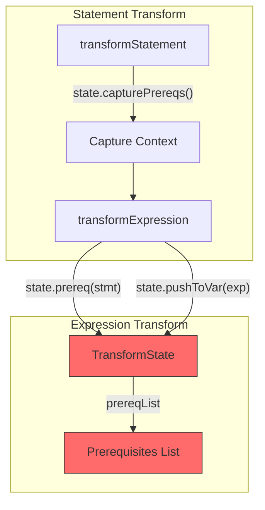
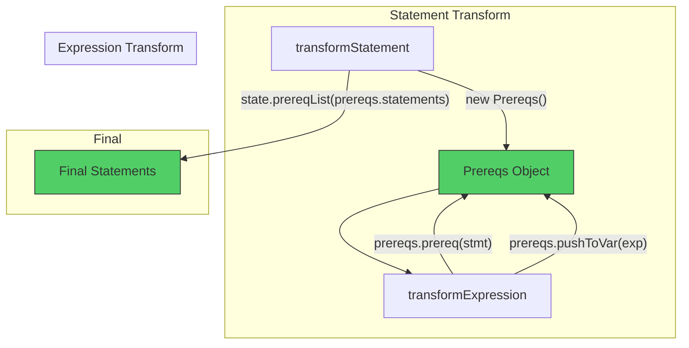
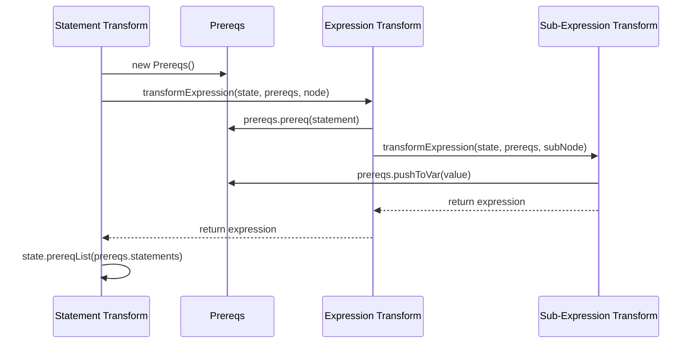

# Prereqs Refactoring Plan

## 📋 Refactoring Status (31 Dec 2024)

**TypeScript Compilation:** ✅ **0 errors**
**TypeScript Tests:** ✅ **142/142 passed**
**Roblox Tests:** ⚠️ **390/498 passed, 108 failures**

### Summary

The goal of refactoring is to introduce a `Prereqs` class to manage prerequisite statements during AST transformation. Instead of using `state.prereq()`, `state.pushToVar()`, etc., transformation functions now use a `Prereqs` object passed as a parameter.

---

## 🔄 Architecture Diagrams

### Before Refactoring (old pattern)



### After Refactoring (new pattern)



### Data Flow - Expression Transforms



---

## ✅ What Was DONE

### 1. Prereqs Class (100%)

- [x] Created `src/TSTransformer/classes/Prereqs.ts`
- [x] Implemented methods: `prereq()`, `prereqList()`, `pushToVar()`, `pushToVarIfComplex()`, `pushToVarIfNonId()`

### 2. Macros (100%)

- [x] `callMacros.ts` - all macros updated
- [x] `constructorMacros.ts` - all macros updated
- [x] `propertyCallMacros.ts` - all macros updated
- [x] `types.ts` - macro types updated

### 3. Utility Functions (100%)

- [x] `ensureTransformOrder.ts` - updated
- [x] `createTruthinessChecks.ts` - updated

### 4. Expression Transforms (100%)

All 34 files in `src/TSTransformer/nodes/expressions/` updated:

- [x] transformArrayLiteralExpression.ts
- [x] transformAwaitExpression.ts
- [x] transformBinaryExpression.ts (partially - internal calls)
- [x] transformBooleanLiteral.ts
- [x] transformCallExpression.ts
- [x] transformClassExpression.ts
- [x] transformConditionalExpression.ts
- [x] transformDeleteExpression.ts
- [x] transformElementAccessExpression.ts
- [x] transformExpression.ts (main dispatcher)
- [x] transformFunctionExpression.ts
- [x] transformIdentifier.ts
- [x] transformImportExpression.ts
- [x] transformNewExpression.ts
- [x] transformNoSubstitutionTemplateLiteral.ts
- [x] transformNumericLiteral.ts
- [x] transformObjectLiteralExpression.ts
- [x] transformOmittedExpression.ts
- [x] transformParenthesizedExpression.ts
- [x] transformPropertyAccessExpression.ts
- [x] transformRegularExpressionLiteral.ts
- [x] transformSpreadElement.ts
- [x] transformStringLiteral.ts
- [x] transformSuperKeyword.ts
- [x] transformTaggedTemplateExpression.ts
- [x] transformTemplateExpression.ts
- [x] transformThisExpression.ts
- [x] transformTypeExpression.ts
- [x] transformUnaryExpression.ts
- [x] transformVoidExpression.ts
- [x] transformYieldExpression.ts

### 5. Statement Transforms (partially)

- [x] transformDoStatement.ts
- [x] transformExpressionStatement.ts
- [x] transformForOfStatement.ts (partially)
- [x] transformForStatement.ts (partially)
- [x] transformIfStatement.ts
- [x] transformReturnStatement.ts
- [x] transformSwitchStatement.ts
- [x] transformThrowStatement.ts
- [x] transformVariableStatement.ts (partially)
- [x] transformWhileStatement.ts

---

## ❌ What REMAINS to be done

### 🔴 HARD (Senior) - Require deep understanding of architecture

#### 1. Binding Patterns (4 files)

```
src/TSTransformer/nodes/binding/
├── transformArrayAssignmentPattern.ts - add prereqs to signature
├── transformArrayBindingPattern.ts - add prereqs to signature
├── transformBindingName.ts - add prereqs to signature
└── transformObjectAssignmentPattern.ts - add prereqs to signature
└── transformObjectBindingPattern.ts - add prereqs to signature
```

#### 2. transformBinaryExpression.ts - CRITICAL

File has many internal calls to other functions that don't have prereqs yet:

- `transformArrayAssignmentPattern`
- `transformObjectAssignmentPattern`
- `transformWritableAssignment`
- `transformLogicalOrCoalescingAssignmentExpression`

#### 3. transformWritable.ts

- `transformWritableExpression` - add prereqs
- `transformWritableAssignment` - add prereqs

#### 4. transformLogical.ts / transformLogicalOrCoalescingAssignmentExpression.ts

Complex logic with chain building - requires careful refactoring.

#### 5. transformOptionalChain.ts

Handle optional chaining with prereqs.

### 🟡 MEDIUM (Mid-level)

#### 6. Class Transforms (4 files)

```
src/TSTransformer/nodes/class/
├── transformClassConstructor.ts
├── transformClassLikeDeclaration.ts
├── transformDecorators.ts
└── transformPropertyDeclaration.ts
```

#### 7. JSX Transforms (5 files)

```
src/TSTransformer/nodes/jsx/
├── transformJsx.ts
├── transformJsxAttributes.ts
├── transformJsxChildren.ts
├── transformJsxFragment.ts
└── transformJsxTagName.ts
```

### 🟢 EASY (Junior) - Simple call updates

#### 8. Statement Transforms - remaining calls

- transformEnumDeclaration.ts - 2 transformExpression calls
- transformExportAssignment.ts - 3 transformExpression calls
- transformFunctionDeclaration.ts - 1 call

#### 9. Call updates in already changed files

Search pattern: `transformExpression(state,` without `prereqs`

---

## 📝 Patterns to Apply

### Pattern 1: Call from expression transform to expression transform

```typescript
// BEFORE:
const exp = transformExpression(state, node);

// AFTER:
const exp = transformExpression(state, prereqs, node);
```

### Pattern 2: Call from statement transform

```typescript
// BEFORE:
const [exp, prereqs] = state.capture(() => transformExpression(state, node));

// AFTER:
const prereqs = new Prereqs();
const exp = transformExpression(state, prereqs, node);
// or if list is needed:
const [exp, stmtPrereqs] = state.capture(() => transformExpression(state, new Prereqs(), node));
```

### Pattern 3: Replace state.prereq with prereqs.prereq

```typescript
// BEFORE:
state.prereq(statement);
state.pushToVar(exp);

// AFTER:
prereqs.prereq(statement);
prereqs.pushToVar(exp);
```

---

## 🎯 Execution Order

### Phase 1: Senior (currently in progress)

1. ✅ Prereqs class
2. ✅ Macro types and implementations
3. ✅ Utility functions
4. 🔄 transformBinaryExpression - fix internal calls
5. ⏳ Binding patterns
6. ⏳ transformWritable.ts
7. ⏳ transformLogical.ts
8. ⏳ transformOptionalChain.ts

### Phase 2: Mid-level

9. ⏳ Class transforms
10. ⏳ JSX transforms

### Phase 3: Junior

11. ⏳ Remaining statement transforms
12. ⏳ Cleanup and lint fixes

---

## 🔧 Verification Commands

```bash
# Check TypeScript errors
npm run build

# Find remaining state.prereq calls
grep -r "state\.prereq\(" src/TSTransformer/nodes/expressions/

# Find transformExpression calls without prereqs
grep -r "transformExpression(state," src/ | grep -v "prereqs"

# Run linter
npm run eslint
```

---

## 📊 Progress Statistics (Update: 31.12.2024)

| Category                                    | Done | Remaining | %        |
| ------------------------------------------- | ---- | --------- | -------- |
| Prereqs class                               | 1/1  | 0         | 100%     |
| Macros                                      | 3/3  | 0         | 100%     |
| Utilities                                   | 2/2  | 0         | 100%     |
| Expression transforms (signatures)          | 34/34| 0         | 100%     |
| transformWritable                           | 1/1  | 0         | 100%     |
| BindingAccessor (getAccessorForBindingType) | 1/1  | 0         | 100%     |
| SpreadDestructor (5 files)                  | 5/5  | 0         | 100%     |
| transformVariable                           | 1/1  | 0         | 100%     |
| transformObjectBindingPattern               | 1/1  | 0         | 100%     |
| transformArrayBindingPattern                | 1/1  | 0         | 100%     |
| transformBindingName                        | 1/1  | 0         | 100%     |
| transformPropertyName                       | 1/1  | 0         | 100%     |
| transformParameters                         | 1/1  | 0         | 100%     |
| transformOptionalChain                      | 1/1  | 0         | 100%     |
| transformLogical                            | 1/1  | 0         | 100%     |
| transformLogicalOrCoalescingAssignment      | 1/1  | 0         | 100%     |
| transformEntityName                         | 1/1  | 0         | 100%     |
| objectAccessor                              | 1/1  | 0         | 100%     |
| bitwise.ts                                  | 1/1  | 0         | 100%     |
| createHoistDeclaration                      | 1/1  | 0         | 100%     |
| **Binding Assignment Patterns**             | 2/2  | 0         | 100%     |
| **Class transforms (call sites)**           | 4/4  | 0         | 100%     |
| **JSX transforms**                          | 5/5  | 0         | 100%     |
| **Statement transforms (call sites)**       | 22/22| 0         | 100%     |
| **TypeScript Compilation**                  | ✅   | 0 errors  | **100%** |
| **TypeScript Tests**                        | 142/142 | 0 failures | **100%** |
| **Roblox Tests**                            | 390/498 | 108 failures | **78%** |

### ✅ Fixed Files (all TypeScript errors eliminated):

**Binding Patterns:**

- ✅ `transformArrayAssignmentPattern.ts` - all calls updated
- ✅ `transformObjectAssignmentPattern.ts` - all calls updated
- ✅ `transformBindingName.ts` - updated

**Class Transforms:**

- ✅ `transformClassLikeDeclaration.ts` - added Prereqs import, fixed calls
- ✅ `transformDecorators.ts` - fixed transformExpression call

**Expression Transforms:**

- ✅ `transformBinaryExpression.ts` - fixed calls, removed prereqs from createBinaryFromOperator
- ✅ `transformElementAccessExpression.ts` - added prereqs to transformOptionalChain
- ✅ `transformPropertyAccessExpression.ts` - added prereqs to transformOptionalChain
- ✅ `transformUnaryExpression.ts` - added prereqs to transformWritableExpression
- ✅ `transformVoidExpression.ts` - removed prereqs from transformExpressionStatementInner
- ✅ `transformClassExpression.ts` - removed prereqs from transformClassLikeDeclaration
- ✅ `transformArrayLiteralExpression.ts` - partially fixed (state→prereqs)

**Statement Transforms:**

- ✅ `transformExportAssignment.ts` - all calls updated
- ✅ `transformExpressionStatement.ts` - added prereqs to transformWritableExpression/Assignment
- ✅ `transformForOfStatement.ts` - fixed state.capture blocks
- ✅ `transformFunctionDeclaration.ts` - added prereqs to transformIdentifierDefined
- ✅ `transformImportDeclaration.ts` - unchanged (doesn't accept prereqs)
- ✅ `transformImportEqualsDeclaration.ts` - fixed transformVariable calls
- ✅ `transformModuleDeclaration.ts` - added prereqs to transformIdentifierDefined
- ✅ `transformEnumDeclaration.ts` - added prereqs to transformExpression

**JSX:**

- ✅ `transformJsxAttributes.ts` - all calls updated
- ✅ `transformJsxChildren.ts` - added prereqs, fixed ensureTransformOrder
- ✅ `transformJsxTagName.ts` - added prereqs to transformExpression

**Core:**

- ✅ `transformInitializer.ts` - uses own innerPrereqs to avoid circular references

---

## ⚠️ Known Issues and Warnings

### 🐛 Main Issue: Inconsistent use of state.prereq vs prereqs.prereq

**Symptoms:**

- 108 Roblox tests fail (mainly array spread, destructure)
- `nil` values instead of expected values
- Incorrect order of statements in generated Luau code

**Cause:**
Many functions accept `prereqs: Prereqs` as a parameter, but internally still use `state.prereq()` instead of `prereqs.prereq()`. This causes prerequisite statements to be added to the global state instead of the local prereqs object, resulting in:

1. Statements executed in wrong order
2. Statements added outside `state.capture()` block
3. Loss of synchronization between `prereqs.statements` and actual operations

**Affected files:**

- `transformArrayLiteralExpression.ts` - partially fixed (uses prereqs.prereq)
- `transformForOfStatement.ts` - mixed usage
- `transformInitializer.ts` - fixed (uses own innerPrereqs)
- Many other expression transform files

**Solution:**
Systematically review all functions that accept `prereqs: Prereqs` and replace internal `state.prereq()` calls with `prereqs.prereq()`. This applies especially to:

- Expression transformation functions
- Helper functions in binding patterns
- Internal nested functions

### ⚠️ Notes

1. After each change run `npm run build` to check for errors
2. Don't remove `state.capturePrereqs` or `state.capture` - they're still needed in statement transforms
3. `transformInitializer` function uses its own `innerPrereqs` to avoid circular references
4. In `state.capture()` blocks, prereqs must be created inside and their statements added to state
5. Some files have mixed usage - some functions updated, some not
6. ESLint warnings about unused parameters are OK for interface consistency
